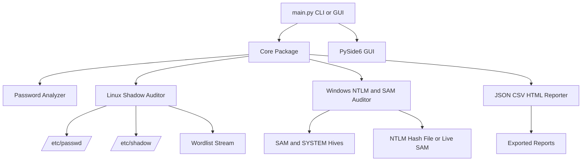

# PassGuard Architecture

```mermaid
flowchart TD
    Entry[main.py CLI or GUI] --> Core[Core Package]
    Entry --> PySide[PySide6 GUI]
    Core --> Checker[Password Analyzer]
    Core --> Linux[Linux Shadow Auditor]
    Core --> Windows[Windows NTLM and SAM Auditor]
    Core --> Reports[JSON CSV HTML Reporter]
    Linux --> Passwd[/etc/passwd/]
    Linux --> Shadow[/etc/shadow/]
    Linux --> Wordlist[Wordlist Stream]
    Windows --> Hive[SAM and SYSTEM Hives]
    Windows --> NTLM[NTLM Hash File or Live SAM]
    Reports --> Export[Exported Reports]
```
